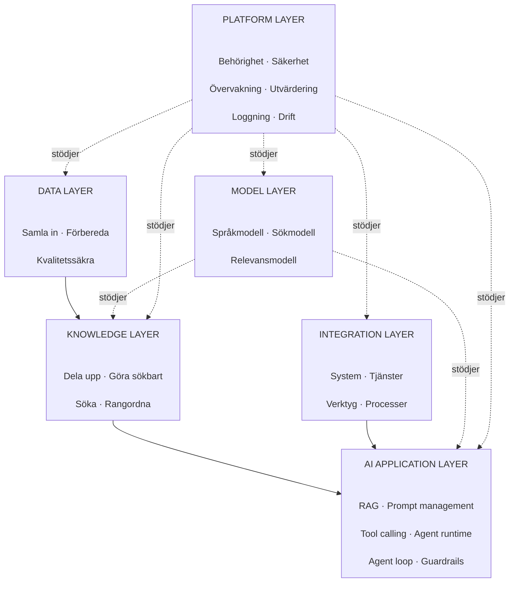
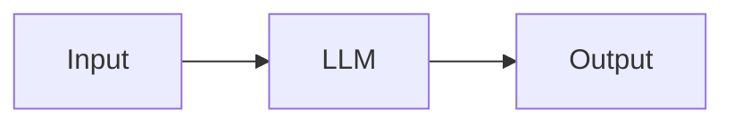
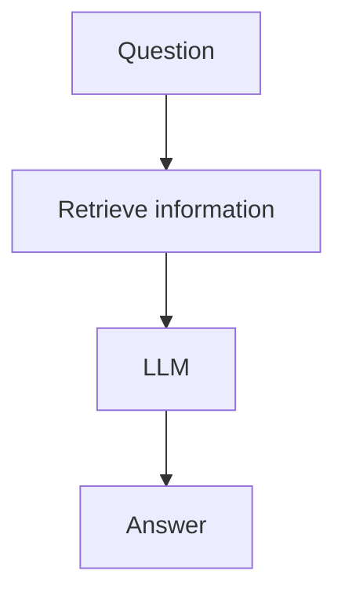
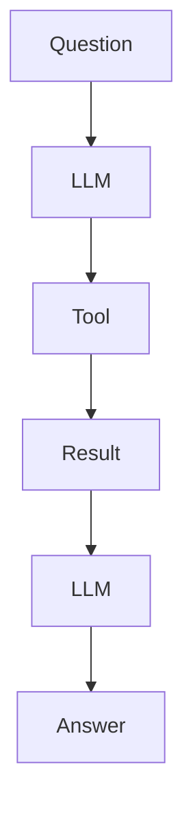
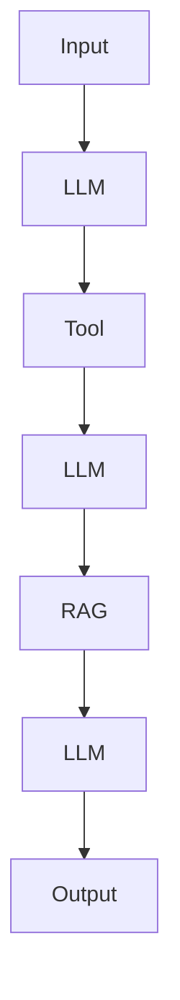
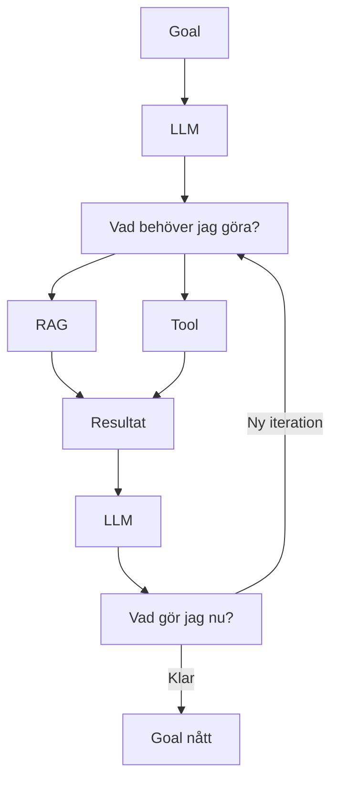

# AI infra lager

| Lager | Ansvar |
| --- | --- |
| **Data layer** | Få in, rengöra, transformera och kvalitetssäkra rådata |
| **Knowledge layer** | Göra data till sökbar/användbar kunskap |
| **Integration layer** | Ge AI-systemet tillgång till externa system och funktioner |
| **AI application layer** | Bygga själva AI-beteendet och applikationslogiken |
| **Model layer** | Abstrahera och tillhandahålla modeller |
| **Platform layer** | Säkerhet, drift, observability, governance och deployment |

## LLM flöde enkel

## RAG enkel

## Tool enkel

## Workflow enkel

## Agent enkel

