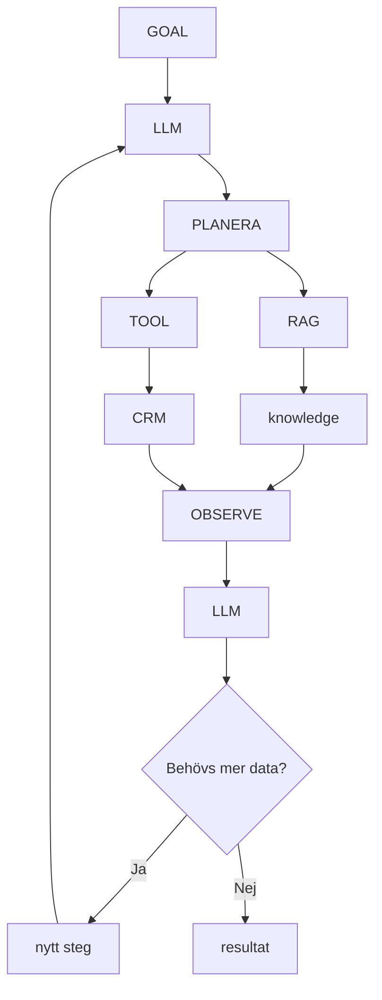
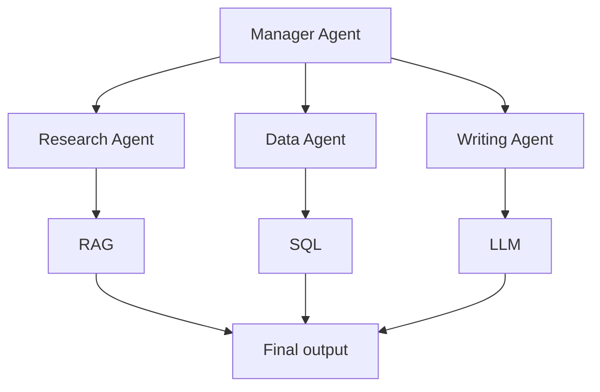

# AI-Agent

```mermaid
flowchart TD
    GOAL --> L1[LLM]
    L1 --> PLANERA
    PLANERA --> RAG
    PLANERA --> TOOL
    RAG --> knowledge
    TOOL --> CRM
    knowledge --> OBSERVE
    CRM --> OBSERVE
    OBSERVE --> L2[LLM]
    L2 --> D{"Behövs mer data?"}
    D -->|Ja| NS[nytt steg]
    NS --> L1
    D -->|Nej| resultat
```

## Multi agent

```mermaid
flowchart TD
    MA[Manager Agent]
    MA --> RA[Research Agent]
    MA --> DA[Data Agent]
    MA --> WA[Writing Agent]
    RA --> RAG
    DA --> SQL
    WA --> LLM
    RAG --> FO[Final output]
    SQL --> FO
    LLM --> FO
```
