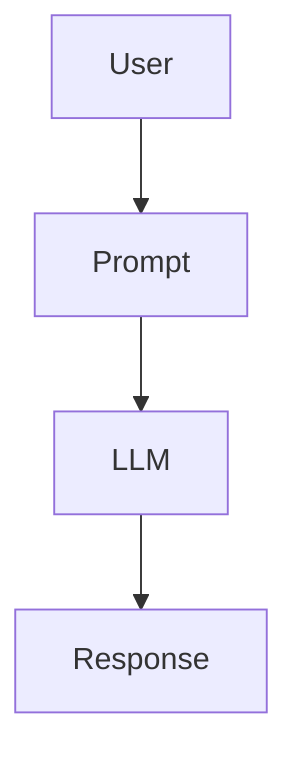
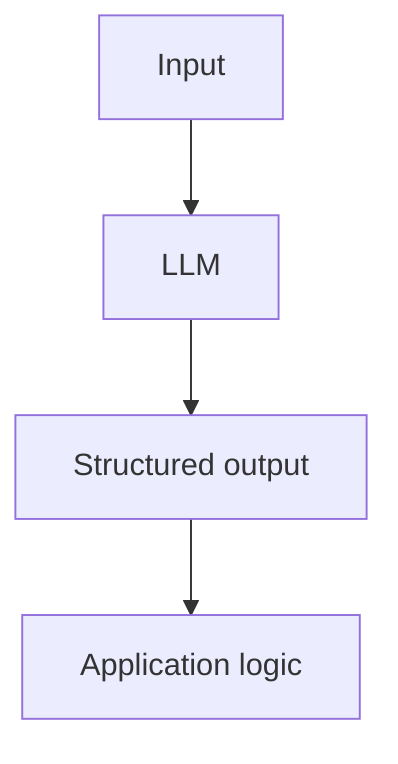
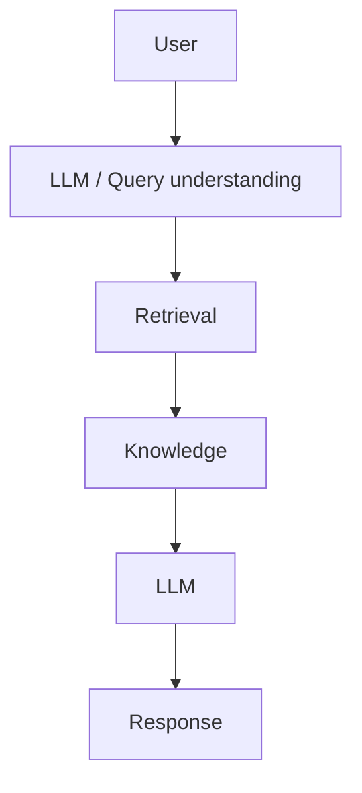
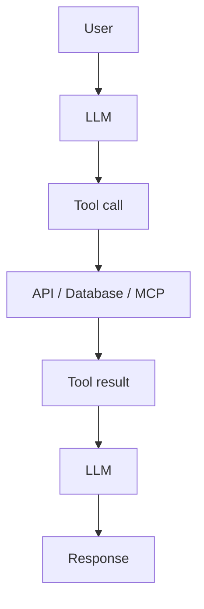
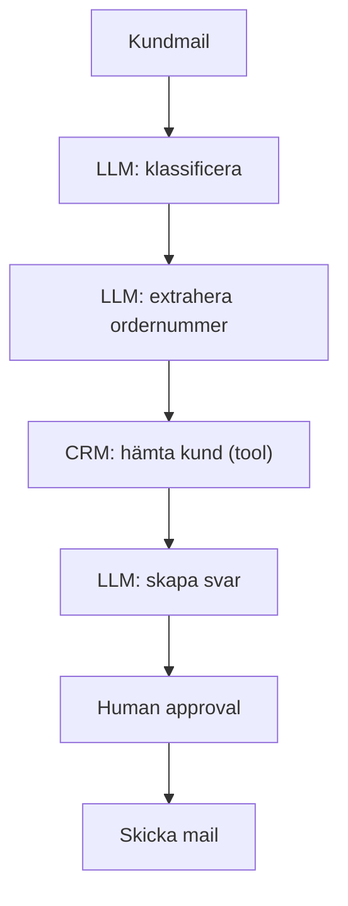
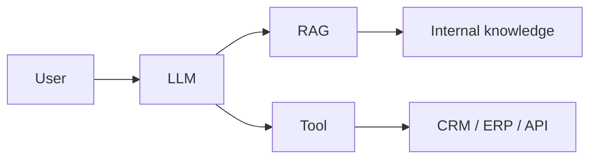

# Ren LLM-applikation

```mermaid
flowchart TD
    User --> Prompt --> LLM --> Response
```

## LLM-applikation med strukturerat svar

```mermaid
flowchart TD
    Input --> LLM --> SO[Structured output] --> AL[Application logic]
```

## LLM och RAG

```mermaid
flowchart TD
    User --> QU["LLM / Query understanding"] --> Retrieval --> Knowledge --> LLM --> Response
```

## LLM + tool calling

```mermaid
flowchart TD
    User --> L1[LLM] --> TC[Tool call] --> EXT["API / Database / MCP"] --> TR[Tool result] --> L2[LLM] --> Response
```

## Workflow och LLM

```mermaid
flowchart TD
    KM[Kundmail] --> C["LLM: klassificera"] --> E["LLM: extrahera ordernummer"] --> CRM["CRM: hämta kund (tool)"] --> S["LLM: skapa svar"] --> HA["Human approval"] --> SM["Skicka mail"]
```

## RAG + tool calling

```mermaid
flowchart LR
    User --> LLM
    LLM --> RAG --> IK[Internal knowledge]
    LLM --> Tool --> EXT["CRM / ERP / API"]
```
